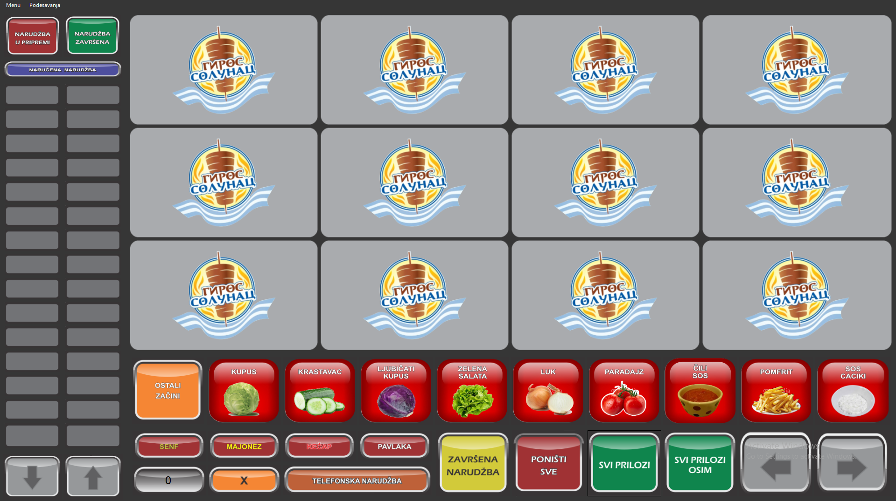
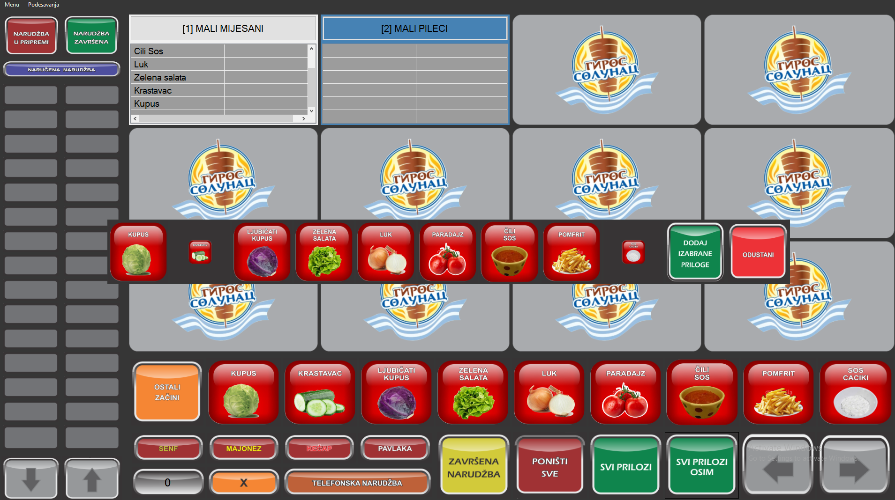
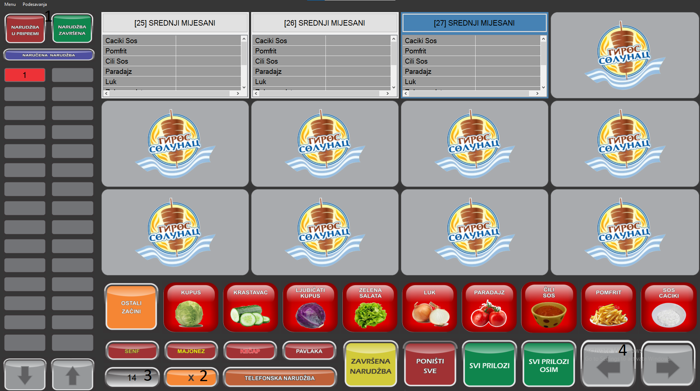
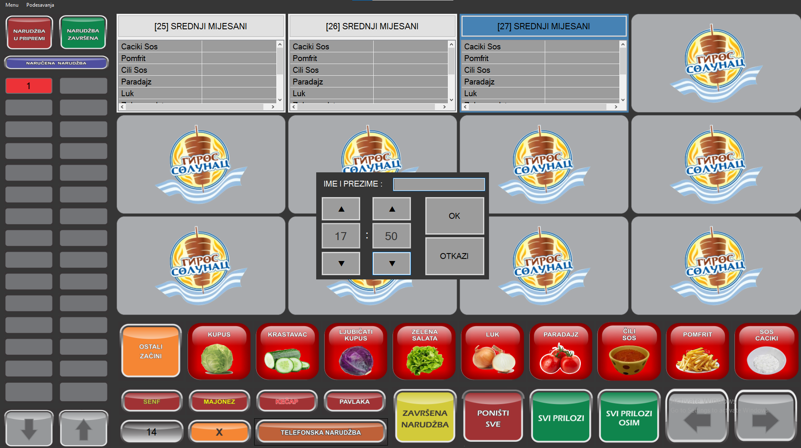
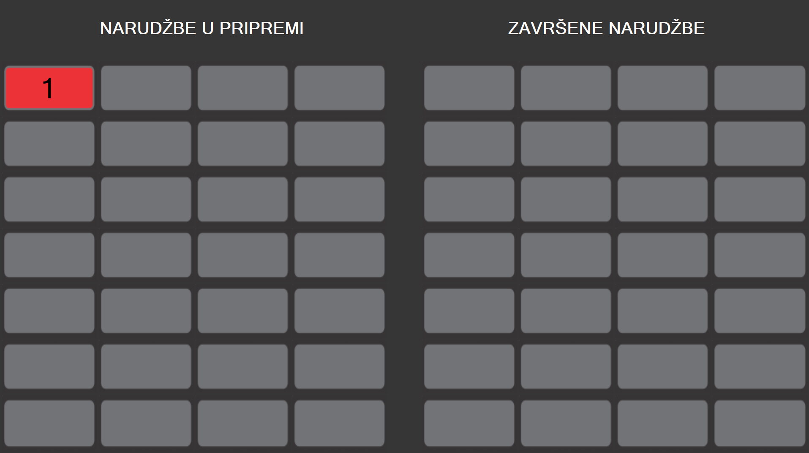

# Giros-Solunac

Welcome to our fast food ordering application! Our user-friendly platform allows employees to quickly and easily place orders for pickup or delivery. With a wide variety of menu options and customization features, employees can easily tailor their orders to their preferences.

Our application is fully adaptable to the work environment and requires a printer and secondary monitor for optimal performance. Additionally, the application has communication capabilities with other computers, further enhancing the efficiency of the entire system.

# Preview (part of the app)

  
  
Picture 1 - Main screen.

  
  
Picture 2 - Selection of toppings for order.

  
  

  Picture 3 - Main functionalities: 
    1) Orders can be marked as completed or in preparation
    2) Button for copying selected order
    3) Number of gyros being prepared (to estimate wait time)
    4) Additional screens for processing large orders.

  
  
Picture 4 - Scheduling orders for a specific time.

  
  
Picture 5 - Second screen, displaying orders in preparation and those that are completed.

